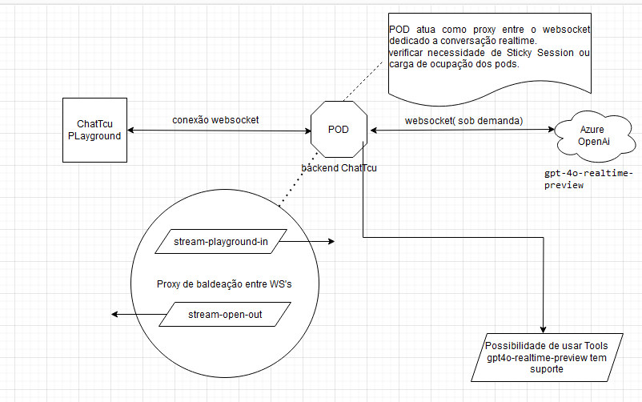
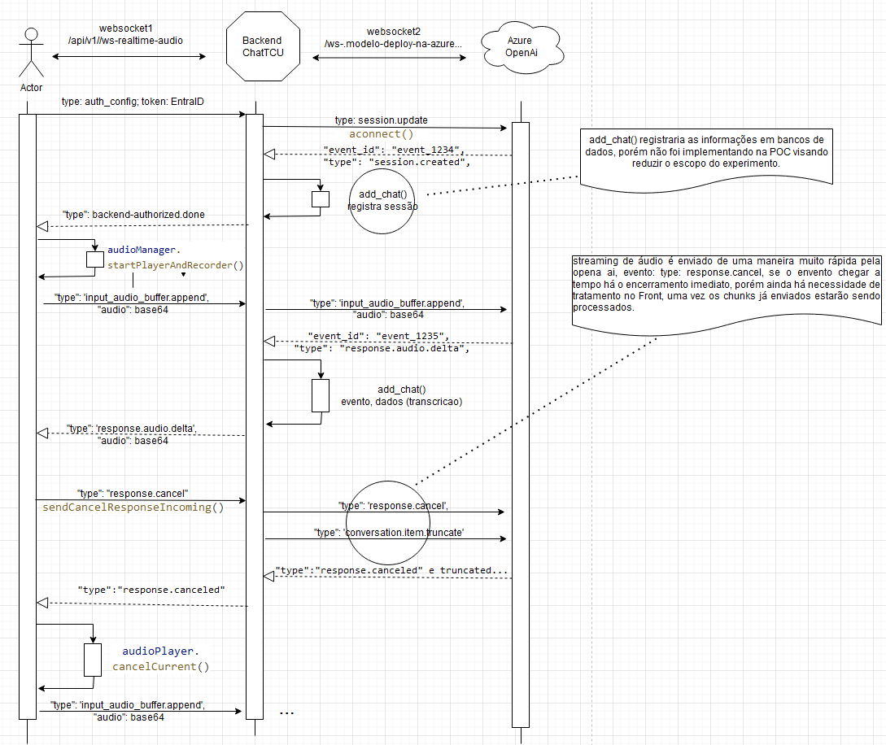
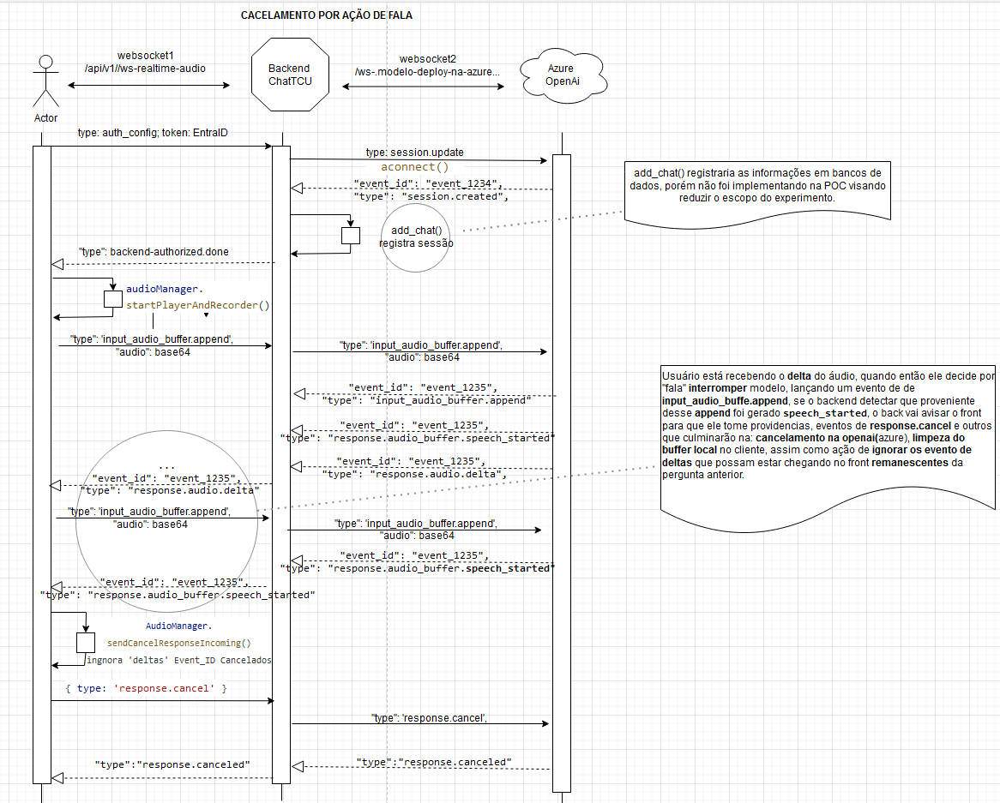

# OpenAI Azure Service (ChatTCU)

## Introdução

Este documento serve como um guia para a instalação, configuração e uso de uma aplicação desenvolvida em Python utilizando o framework FastAPI. FastAPI é um framework web moderno e rápido (alta performance) para construir APIs com Python 3.7+ baseado em padrões Python type hints.

## Estrutura do Projeto:
- Dockerfile
- Jenkinsfile
- devbox.json
- requirements.txt
- README.md

## Pré-requisitos

Antes de começar, certifique-se de que você tem o seguinte instalado em seu sistema:

- Python 3.11 ou superior
- Azure CLI
- Virtualenv (recomendado)
- LibreOffice

### Outros 
- WSL: É um recurso do Windows que permite executar um ambiente Linux... [Saiba mais](https://learn.microsoft.com/pt-br/windows/wsl/about)

- DEVBOX: Ferramenta em linha de comando que permite criar ambientes de desenvolvimento isolado. [Saiba mais](https://www.jetify.com/devbox/docs/)

- DIRENV: Ferramenta de gerenciamento de ambiente que permite configurar variáveis únicas por diretório. [Saiba mais](https://www.jetify.com/devbox/docs/ide_configuration/direnv/)

#### Instalação
Os recursos devem ser instalados na seguinte ordem:

##### WSL:

Para instalar o wsl é necessário executar o comando abaixo:

```
wsl --install -d Ubuntu
```

Confirme a versão do wsl instalado usando o comando:

```
wsl -l -v
```

Caso a versão instalada não seja a versão 2, execute o comando abaixo para alterar:

```
wsl --set-version Ubuntu 2
```

##### DEVBOX:

Caso a instalação seja feita em estação de trabalho dentro da rede interna do TCU é necessário importar os certificados:

https://git.tcu.gov.br/docker/imagens/-/raw/master/k8s-kubectl-tcu/srv-ca01.crt

https://git.tcu.gov.br/docker/imagens/-/raw/master/k8s-kubectl-tcu/srv-ca02-novo.crt

O import deve ser feito de acordo com a distribuição usada. Para distribuições baseadas em Debian pode-se usar o guia abaixo:

https://ubuntu.com/server/docs/install-a-root-ca-certificate-in-the-trust-store

Prosseguir com a instalação do devbox:

```
curl -fsSL https://get.jetify.com/devbox | bash
```

##### DIRENV:

Para instalar o direnv siga a documentação de acordo com a distribuição usada. Para distribuições baseadas em debian:

```
sudo apt-get install direnv
```

Após instalação do direnv é necessário realizar a configuração junto ao shell utilizado. Para bash é necessário adicionar a linha abaixo ao .bashrc

```
eval "$(direnv hook bash)"
```

## Configuração do Ambiente

### Virtualenv

É altamente recomendado o uso de `virtualenv` para criar um ambiente isolado para a aplicação. Isso ajuda a evitar conflitos entre as dependências do projeto e as bibliotecas globais do sistema.

Para criar um novo ambiente virtual, execute:

```bash
python -m venv venv
```

Para ativar o ambiente virtual, use:

- No Windows:

```bash
.\venv\Scripts\activate
```

- No Linux ou macOS:

```bash
source venv/bin/activate
```
### OBS: VENV para TESTES usando a IDE Intellij
Caso estiver usando o Intellij, ou Pycharm como IDE, e encontre problemas ao tentar rodar seus testes no pytest .
Crie seu virtual environment pela IDE .
Vá em seu projeto -> Project Structure -> SDKs -> Add new SDK -> Add python SDK from disk...
Aparecera VirtualEnv Environment 
Nas configurações
use : `seuDominio`/openai-azure-service/venv

### Instalação de Dependências

Dependendo do ambiente em que você está trabalhando (desenvolvimento ou produção), você precisará instalar as dependências necessárias usando `pip`.

- Para ambientes de **produção**, execute:

```bash
pip install -r requirements.txt
```

- Para ambientes de **desenvolvimento**, use:

```bash
pip install -r requirements_test.txt
```

## Configuração de Variáveis de Ambiente

A aplicação espera uma variável de ambiente chamada `PROFILE`, que indica o ambiente no qual a aplicação está sendo executada. Por exemplo, para um ambiente de desenvolvimento local, você configuraria:

```bash
export PROFILE=local
```

No Windows, use:

```bash
set PROFILE=local
```

## Azure CLI e Azure Keyvault

Antes de iniciar a aplicação, é necessário fazer login no Azure usando o Azure CLI para acessar o Azure Keyvault. Isso é essencial para garantir que a aplicação possa acessar de forma segura as chaves e segredos armazenados no Keyvault.

Para fazer login, execute:

```bash
az login
```

Siga as instruções na tela para completar o processo de login.

## LibreOffice

O LibreOffice é utilizado para a conversão de documentos DOCX para PDF na ação de upload de arquivos. Ele se faz necessário para que o texto extraído esteja associado a sua respectiva página.

Se a aplicação for rodar a partir de um container Docker é necessário o download do arquivo .deb na pasta **resources**, localizada na raiz do projeto, antes do build da imagem. Caso a aplicação rode diretamente de um sistema o LibreOffice deverá estar devidamente instalado no sistema, seguindo a instalação padrão.

O download pode ser realizado através do endereço: https://tdf.c3sl.ufpr.br/libreoffice/stable/24.2.4/deb/x86_64/LibreOffice_24.2.4_Linux_x86-64_deb.tar.gz

**Deverá ser verificado a versão disponível. No momento a maior versão disponível é a que consta no link acima.**

## Executando a Aplicação

Com todas as configurações feitas, você está pronto para executar a aplicação. FastAPI vem com um servidor de desenvolvimento embutido. Para iniciar sua aplicação, execute:

```bash
uvicorn main:app --reload --port 3030
```

O parâmetro `--reload` faz com que o servidor reinicie automaticamente após mudanças no código. Isso é útil durante o desenvolvimento, mas deve ser removido em ambientes de produção.

O parâmetro `--port 3030` define a porta de acesso aos endpoints do servidor. Isso é útil quando há vários serviços rodando no mesmo ambiente.

## Crie um arquivo env.local
Dentro se seu projeto crie um arquivo env.local, e adicione o conteudo
dependendo do perfil que será simulado no ambiente de DEV, use UMA das linhas abaixo no conteudo de seu arquivo:

REACT_APP_SIGA_PROFILE=PERFIL_COMUM
REACT_APP_SIGA_PROFILE=PERFIL_PREVIEW
REACT_APP_SIGA_PROFILE=PERFIL_DEV

## Crie um arquivo package-lock.json com o conteúdo:
{  "name": "openai-azure-service",  "lockfileVersion": 3,  "requires": true,  "packages": {}}

## Conclusão

Parabéns! Você configurou e iniciou sua aplicação FastAPI. Este guia cobriu a configuração básica e a execução da aplicação. Lembre-se de sempre trabalhar dentro de um ambiente virtual para evitar conflitos de dependência e garantir que todas as variáveis de ambiente necessárias estejam configuradas corretamente, especialmente ao trabalhar com serviços em nuvem como o Azure.

Se tiver dúvidas ou encontrar problemas, não hesite em consultar a documentação oficial do FastAPI e do Azure CLI para mais informações e suporte.


---
# Módulos e Documentações:

## 📌 Módulo: Assistente Virtual Realtime Áudio TCU

Demonstrar a interação com a **OpenAI (Azure)** utilizando o modelo **gpt4o-Realtime-x** para comunicação por voz. A aplicação inclui:

- Transcrição de áudio em tempo real.
- Integração com ferramentas acessadas pelo modelo, índice Cognitive Search.
- Implementação de **interrupção de fala** via:
  - Botão de cancelar.
  - Detecção natural de fala.
  obs.: (ambos sem perda da sessão atual)

## 🛠️ Arquitetura e Funcionamento

O módulo de áudio é composto por uma **primeira conexão** WebSocket entre o **cliente (SPA React)** e o **backend (atual)**. O backend atua como proxy para um **segunda conexão** websocket com o modelo **gpt4o-Realtime-Preview**, hospedado na Azure, gerenciando eventos bidirecionais entre:
1. **[Frontend (React/TS)](https://git.tcu.gov.br/nucleo-ia/openai-azure-service-playground).**
2. **Backend (Python).**
3. **Modelo da OpenAI.**

### 🖼️ Diagrama Geral



---

### 🔄 Diagramas de Sequência

#### **1. Fluxo Conversação Voz - com cancelamento de Resposta do modelo por Botão:**

  

#### **2. Fluxo Conversação Voz - com cancelamento de Resposta do modelo por Fala do ator:**

  

---

## ⚙️ Principais recursos deste módulo de áudio:

As principais classes e componentes incluem:
- **OpenAIRealTimeClient:** Gerencia a comunicação com o modelo.
- **ConfigRealtime:** Configurações da sessão.
- **VoiceToolExecutor:** Executa as ações baseadas em comandos de voz.
    Obs.: possibilidade de consumir índices do cognitive search.